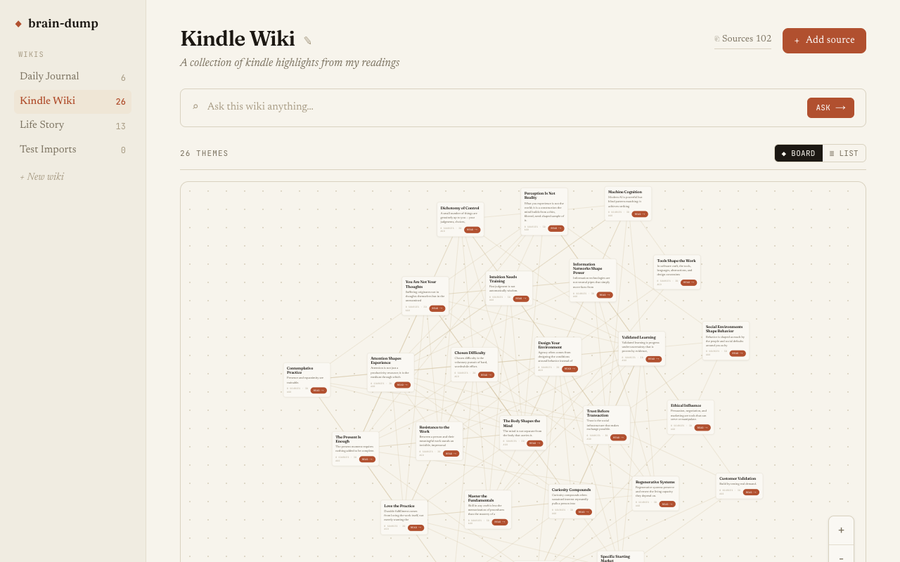
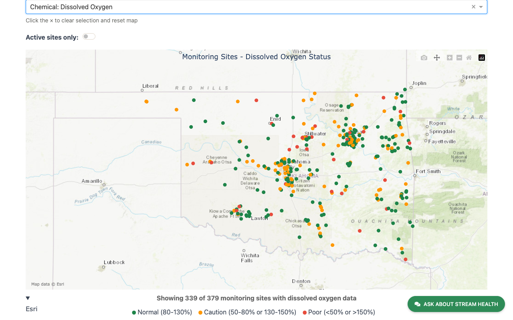
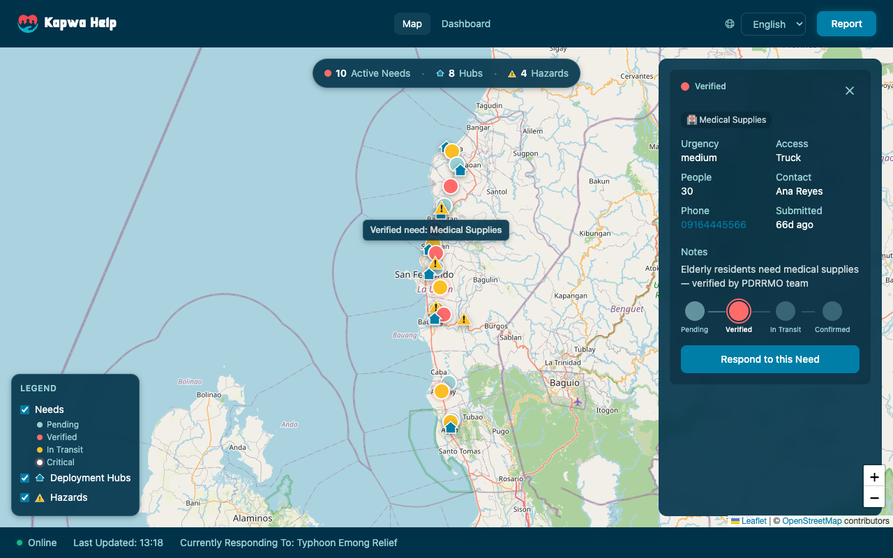
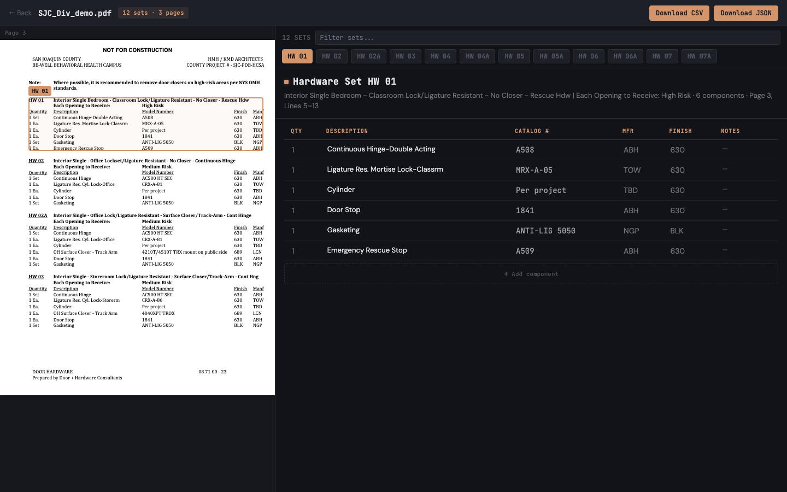

# Hi, I'm Jacob 👋

### I build and ship production AI systems, from voice agents to data infrastructure.

Biosystems engineer turned software developer. I pair a problem-solving background with hands-on AI engineering to take real-world problems from messy idea to deployed product. Below is what I've been working on.

---

## Selected work

<table>
  <tr>
    <td width="50%" valign="top">
      
        
      <b>Distll</b> 
      An AI thought partner that turns raw inputs into living, self-organizing wikis.  
      Vercel AI SDK · Next.js · TypeScript 
      <i>Demo available on request</i>
    </td>
    <td width="50%" valign="top">
      
        
      <b><a href="https://github.com/Jaskey15/lead-nurture-pipeline">lead-nurture-pipeline</a></b> 
      AI SMS nurture system shipped for two detailing brands, sending 1,000+ messages a week from their existing CRM.  
      n8n · LLM · CRM integration 
      <a href="https://github.com/Jaskey15/lead-nurture-pipeline">→ Case study</a>
    </td>
  </tr>
  <tr>
    <td width="50%" valign="top">
      
        
      <b><a href="https://github.com/Jaskey15/blue-thumb-dashboard">blue-thumb-dashboard</a></b> 
      Stream-health dashboard integrated with GCP, visualizing 20+ years of Oklahoma water-quality data.  
      Python · Plotly · GCP · ArcGIS 
      <a href="https://blue-thumb-dashboard-879603271232.us-central1.run.app/">→ Live dashboard</a> &nbsp;·&nbsp; <a href="https://github.com/Jaskey15/blue-thumb-dashboard">Code</a>
    </td>
    <td width="50%" valign="top">
      
        
      <b><a href="https://kapwa-help.vercel.app/demo/en">kapwa-help</a></b> 
      PWA for disaster-relief operations in the Philippines.  
      React · TypeScript · Vite 
      <a href="https://kapwa-help.vercel.app/demo/en">→ Live demo</a> &nbsp;·&nbsp; <a href="https://github.com/kapwa-help/kapwa-help">Code</a>
    </td>
  </tr>
  <tr>
    <td width="50%" valign="top">
      
        
      <b><a href="https://github.com/Jaskey15/specbook-extractor">specbook-extractor</a></b> 
      Turns messy Division 08 spec PDFs into clean, structured hardware data (CSV / JSON).  
      Python · LLM extraction 
      <a href="https://specbook-extractor.fly.dev">→ Live demo</a> &nbsp;·&nbsp; <a href="https://github.com/Jaskey15/specbook-extractor">Code</a>
    </td>
    <td width="50%" valign="top">
      
        
      <b><a href="https://github.com/Jaskey15/realtime-interview-practice">realtime-interview-practice</a></b> 
      Voice-based AI interviewer with live conversation and graded feedback.  
      Next.js · TypeScript · OpenAI Realtime API 
      <a href="https://github.com/Jaskey15/realtime-interview-practice">→ Code</a>
    </td>
  </tr>
</table>

---

### Tools & stack

![Conductor](https://img.shields.io/badge/Conductor-000000?style=flat&logo=data%3Aimage%2Fpng%3Bbase64%2CiVBORw0KGgoAAAANSUhEUgAAAEAAAABACAYAAACqaXHeAAAAAXNSR0IArs4c6QAAACBjSFJNAAB6JgAAgIQAAPoAAACA6AAAdTAAAOpgAAA6mAAAF3CculE8AAAAeGVYSWZNTQAqAAAACAAEARoABQAAAAEAAAA%2BARsABQAAAAEAAABGASgAAwAAAAEAAgAAh2kABAAAAAEAAABOAAAAAAAAAEgAAAABAAAASAAAAAEAA6ABAAMAAAABAAEAAKACAAQAAAABAAAAQKADAAQAAAABAAAAQAAAAAB13naHAAAACXBIWXMAAAsTAAALEwEAmpwYAAABWWlUWHRYTUw6Y29tLmFkb2JlLnhtcAAAAAAAPHg6eG1wbWV0YSB4bWxuczp4PSJhZG9iZTpuczptZXRhLyIgeDp4bXB0az0iWE1QIENvcmUgNi4wLjAiPgogICA8cmRmOlJERiB4bWxuczpyZGY9Imh0dHA6Ly93d3cudzMub3JnLzE5OTkvMDIvMjItcmRmLXN5bnRheC1ucyMiPgogICAgICA8cmRmOkRlc2NyaXB0aW9uIHJkZjphYm91dD0iIgogICAgICAgICAgICB4bWxuczp4bXA9Imh0dHA6Ly9ucy5hZG9iZS5jb20veGFwLzEuMC8iPgogICAgICAgICA8eG1wOkNyZWF0b3JUb29sPkZpZ21hPC94bXA6Q3JlYXRvclRvb2w%2BCiAgICAgIDwvcmRmOkRlc2NyaXB0aW9uPgogICA8L3JkZjpSREY%2BCjwveDp4bXBtZXRhPgoE%2F1zIAAAGrUlEQVR4Ae1bXUxcRRQ%2Bc3eBXTZQKPSP0p8HldjEhhgTESNabU2Nmta%2B0PAkPmhbCcT47kOV4ouhTdNqMDGmDzZ9MamatmlTE2raQn%2BA1CcjhqQUbGB3uw%2FtsrCw1%2FNduJvlMvdelp3bLth5YLn3zJw555sz55yZuSPIpVRVVRUnEontGs1sJ100cfXXXZo8aXI3Cf2nFPnuBAKBO6Ojo3EngYQdsaKiYqPQZz4mEo2k6zVCCP7R7arn1fu0rEL8RaSf0YWvKxKJjMiElAKwZnXZRzqJw0zcuFyUlimHdwYYRCM8fF%2BMR2M%2FWOv5LC98FavLOgWJIzzcpRbacn4sZSD2BIOB8omJxCVWJG3K8wCA8hqJtuU%2B6nYjpQlRxyCsYhAumHXSAKwpK2tmlDpWqvKmwgAhVBS4G08kBvDO8AGVlZUbaCbZx4%2FrzYor%2B1e%2FT76CF8Ph8L%2BaoWhq%2BoAQ2v9EeThG1pV1hu4CcX4qER9gt%2FDsyh51i3aC%2Fi4MFNdqk5OTL7Dyz1jIK%2F%2BRdYbufpGarmWTEF44P%2FCcnp5WCqamaeTzpX33knmzwxc8DWr9PAuavFI%2BFApRdXX1koVc0JBljkYiNDY2RgAilzKrs2gSleVl6aQgF4bWthMTE3SopYXaj3RYSTk9X7p4kZr2N1JBQUFOfMzGbAHeFCAMC1AlqCllaWmpkd6az7n%2B5mZHLr17MbVSqZRLr9mRPQUgO1GeTG1PAYCjVV1U8%2FQUgGQyqVp%2FDqtJpfsSnkUBzFVeY9Dz27bxgoNX43NQuNmEWU%2BGHAxqdGSEBgcHcw6DJn%2BlAExNTVGmk5qZmaHpDCsQHLuLiorMvqW%2FnJ2R7uDo%2FBz%2BEF1UFWVhEOb%2BYXMzvdbQwCa6UDyMXn9fP3178oRtJoessbWtjV6uq7PlcaO3l77v6iK%2FX43oyixgikfu57Nn6a2duxZqP%2Femv6%2BPdr65w4jjMmeG%2BX3uwkV6pb7elkdvTw%2FtfnuXMgCUOkFMAacC83YrbnXc6G78rXSlAFiZL4fnpwCoHKXCwkJHdm4RAI3deLjRHQWQENW4UmYMp%2Fb75cuG95atAUC%2FdfMm01Mcw%2BXdInpgtRePx7newlACHteuXpXSJLot6pWyKIDe%2BAiNEPvtCtbwwWDQjmy8RziVKW82AggqV5jyoTB7y%2BIXCdDmzVto3fp1fOywcPTYRCgSjtC9e8OOWZxK5RYjvjILQHj68dQp2vvBPtt%2Br3R30769ewwAMJL5UJRZANQpLi52HF2Yf74oboKvNAw6zV106EY3hXqcv0oBeJyCq%2BpLKQBu5u1GV6VUNnyUAQC%2F75anY62Qb9NAWRRAGKzetImqNmywi4I0Pj5OQ0NDjo4ym9FTUVcZABAGZwFOJ0E40UGkcCpuVoJppDIdVhYGk2zeBw99Sm%2Fs2CE1cwh%2B%2B9YtOtr5DW%2BIyLtFFtjS2kr19a%2Fa8rh%2B%2FRqdOH5c2X6AXBKnIbKhYW7vfme344YIn0TTsaOdhnIyh4jc6N333mcA7DdEKnifEQCoKsqcIARSsSGCnSWn4kZ3aiujKQVA1kG%2Bv3sKgMoRcvPOi9oQcdk2XwyPbHRS5gSx53%2F%2B3Hl69AhfpkqWw3w4gl1hOEu7s32son%2F79RcKc75gx%2BNGb082%2BrnWVZoHzMZwPr2F%2FuzSU7w5ksz4QgSevwjbZlg6SjESRjaZmS1i%2F9%2F4IgTocDv%2BmiU%2F8wBAnTkFkBmWr11Lz9XUgLTk8g8fg%2FHnbLZWs2TGcw2VTQGrINgea9y%2Fn9o7vraSsnruaG%2Bnr7487JpBZsU0o7KnUaDQxaFlyGH7r2qnZ%2B3IUwAy57K148U%2Bq%2BDh1JenADh1nC80TwGQ5fvZKq6Ch1OfnjlBCI7lsdM5gZNgJg2HJF4W5AHd3EGD6k4wd0tKSmjL1q05sR6%2Be5disZhXYfAKA7DqE04uvvPC2SAXyNUCkATZZY65IAsL5WO6A35d8w9wymbkbrkwlLWF4F4IL%2Bsr23c84Dp01zjO%2Fskp5mC2DJZ9fdYZumtz9%2BpOe%2B1t8wmwOV1PQ%2FfZMKj52Qek7ueTkF7KYujKOqMP48N7DjUPQ4FglK8N7PGy43zgjdEXOrWGo9E%2F0gDgH9yiwr063KrKB0G9kAHKp0g%2FFn4QS6%2FQ5l29wKVC3KtbiSCYykeisc8Z3PRuxDwAQMClwlAwMMw7Dy9xo2V%2FexSKsy64OvtZOBrD7Y208rAyKwB4R%2FGJRH%2BwOHSGKPWQG%2BM6XaXByKDm%2F5%2B0rLOXp0%2Fy5emD4eiDKzLJGR7nstKvz%2F8HWndbVzBdvXYAAAAASUVORK5CYII%3D)
![Codex](https://img.shields.io/badge/Codex-000000?style=flat&logo=data%3Aimage%2Fsvg%2Bxml%3Bbase64%2CPHN2ZyByb2xlPSJpbWciIHZpZXdCb3g9IjAgMCAyNCAyNCIgeG1sbnM9Imh0dHA6Ly93d3cudzMub3JnLzIwMDAvc3ZnIj48dGl0bGU%2BT3BlbkFJPC90aXRsZT48cGF0aCBmaWxsPSJ3aGl0ZSIgZD0iTTIyLjI4MTkgOS44MjExYTUuOTg0NyA1Ljk4NDcgMCAwIDAtLjUxNTctNC45MTA4IDYuMDQ2MiA2LjA0NjIgMCAwIDAtNi41MDk4LTIuOUE2LjA2NTEgNi4wNjUxIDAgMCAwIDQuOTgwNyA0LjE4MThhNS45ODQ3IDUuOTg0NyAwIDAgMC0zLjk5NzcgMi45IDYuMDQ2MiA2LjA0NjIgMCAwIDAgLjc0MjcgNy4wOTY2IDUuOTggNS45OCAwIDAgMCAuNTExIDQuOTEwNyA2LjA1MSA2LjA1MSAwIDAgMCA2LjUxNDYgMi45MDAxQTUuOTg0NyA1Ljk4NDcgMCAwIDAgMTMuMjU5OSAyNGE2LjA1NTcgNi4wNTU3IDAgMCAwIDUuNzcxOC00LjIwNTggNS45ODk0IDUuOTg5NCAwIDAgMCAzLjk5NzctMi45MDAxIDYuMDU1NyA2LjA1NTcgMCAwIDAtLjc0NzUtNy4wNzI5em0tOS4wMjIgMTIuNjA4MWE0LjQ3NTUgNC40NzU1IDAgMCAxLTIuODc2NC0xLjA0MDhsLjE0MTktLjA4MDQgNC43NzgzLTIuNzU4MmEuNzk0OC43OTQ4IDAgMCAwIC4zOTI3LS42ODEzdi02LjczNjlsMi4wMiAxLjE2ODZhLjA3MS4wNzEgMCAwIDEgLjAzOC4wNTJ2NS41ODI2YTQuNTA0IDQuNTA0IDAgMCAxLTQuNDk0NSA0LjQ5NDR6bS05LjY2MDctNC4xMjU0YTQuNDcwOCA0LjQ3MDggMCAwIDEtLjUzNDYtMy4wMTM3bC4xNDIuMDg1MiA0Ljc4MyAyLjc1ODJhLjc3MTIuNzcxMiAwIDAgMCAuNzgwNiAwbDUuODQyOC0zLjM2ODV2Mi4zMzI0YS4wODA0LjA4MDQgMCAwIDEtLjAzMzIuMDYxNUw5Ljc0IDE5Ljk1MDJhNC40OTkyIDQuNDk5MiAwIDAgMS02LjE0MDgtMS42NDY0ek0yLjM0MDggNy44OTU2YTQuNDg1IDQuNDg1IDAgMCAxIDIuMzY1NS0xLjk3MjhWMTEuNmEuNzY2NC43NjY0IDAgMCAwIC4zODc5LjY3NjVsNS44MTQ0IDMuMzU0My0yLjAyMDEgMS4xNjg1YS4wNzU3LjA3NTcgMCAwIDEtLjA3MSAwbC00LjgzMDMtMi43ODY1QTQuNTA0IDQuNTA0IDAgMCAxIDIuMzQwOCA3Ljg3MnptMTYuNTk2MyAzLjg1NThMMTMuMTAzOCA4LjM2NCAxNS4xMTkyIDcuMmEuMDc1Ny4wNzU3IDAgMCAxIC4wNzEgMGw0LjgzMDMgMi43OTEzYTQuNDk0NCA0LjQ5NDQgMCAwIDEtLjY3NjUgOC4xMDQydi01LjY3NzJhLjc5Ljc5IDAgMCAwLS40MDctLjY2N3ptMi4wMTA3LTMuMDIzMWwtLjE0Mi0uMDg1Mi00Ljc3MzUtMi43ODE4YS43NzU5Ljc3NTkgMCAwIDAtLjc4NTQgMEw5LjQwOSA5LjIyOTdWNi44OTc0YS4wNjYyLjA2NjIgMCAwIDEgLjAyODQtLjA2MTVsNC44MzAzLTIuNzg2NmE0LjQ5OTIgNC40OTkyIDAgMCAxIDYuNjgwMiA0LjY2ek04LjMwNjUgMTIuODYzbC0yLjAyLTEuMTYzOGEuMDgwNC4wODA0IDAgMCAxLS4wMzgtLjA1NjdWNi4wNzQyYTQuNDk5MiA0LjQ5OTIgMCAwIDEgNy4zNzU3LTMuNDUzN2wtLjE0Mi4wODA1TDguNzA0IDUuNDU5YS43OTQ4Ljc5NDggMCAwIDAtLjM5MjcuNjgxM3ptMS4wOTc2LTIuMzY1NGwyLjYwMi0xLjQ5OTggMi42MDY5IDEuNDk5OHYyLjk5OTRsLTIuNTk3NCAxLjQ5OTctMi42MDY3LTEuNDk5N1oiLz48L3N2Zz4%3D)

