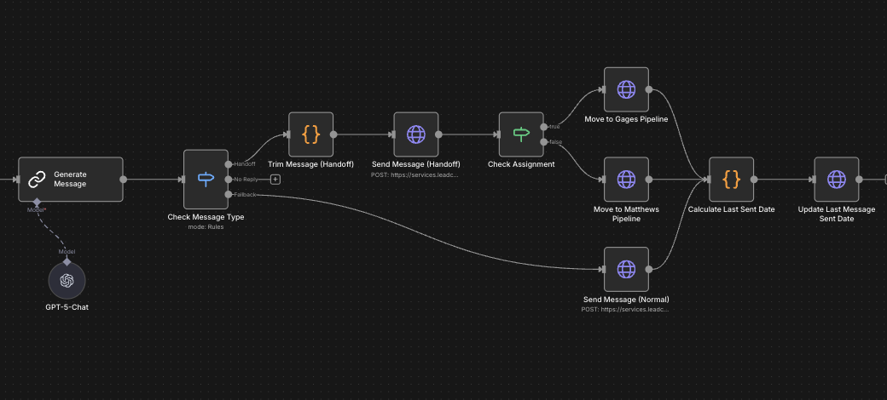

# Hi, I'm Jacob 👋

### I build and ship production AI systems, from voice agents to data infastructure.

Biosystems engineer turned software developer. I pair a problem-solving background with hands-on AI engineering to take real-world problems from messy idea to deployed product. Below is what I've been working on.

---

## Selected work

<table>
  <tr>
    <td width="50%" valign="top">
      
        
      <b><a href="https://brain-dump-lovat.vercel.app">brain-dump</a></b> 
      An AI thought partner that turns raw inputs into living, self-organizing wikis.  
      Vercel AI SDK · Next.js · TypeScript 
      <a href="https://brain-dump-lovat.vercel.app">→ Live demo</a>
    </td>
    <td width="50%" valign="top">
      
        
      <b><a href="https://github.com/Jaskey15/blue-thumb-dashboard">blue-thumb-dashboard</a></b> 
      Stream-health dashboard integrated with GCPvisualizing 20+ years of Oklahoma water-quality data.  
      Python · Plotly · GCP · ArcGIS 
      <a href="https://blue-thumb-dashboard-879603271232.us-central1.run.app/">→ Live dashboard</a> &nbsp;·&nbsp; <a href="https://github.com/Jaskey15/blue-thumb-dashboard">Code</a>
    </td>
  </tr>
  <tr>
    <td width="50%" valign="top">
      
        
      <b><a href="https://github.com/Jaskey15/fresco-challenge">fresco-challenge</a></b> 
      Turns messy Division 08 spec PDFs into clean, structured hardware data (CSV / JSON).  
      Python · LLM extraction 
      <a href="https://github.com/Jaskey15/fresco-challenge">→ Code</a>
    </td>
    <td width="50%" valign="top">
      
        
      <b><a href="https://kapwa-help.vercel.app/demo/en">kapwa-help</a></b> 
      Disaster-relief PWA for disaster relief operations in the Philippines  
      React · TypeScript · Vite 
      <a href="https://kapwa-help.vercel.app/demo/en">→ Live demo</a> &nbsp;·&nbsp; <a href="https://github.com/kapwa-help/kapwa-help">Code</a>
    </td>
  </tr>
  <tr>
    <td width="50%" valign="top">
      
        
      <b><a href="https://github.com/Jaskey15/realtime-interview-practice">realtime-interview-practice</a></b> 
      Voice-based AI interviewer with live conversation and graded feedback.  
      Next.js · TypeScript · OpenAI Realtime API 
      <a href="https://github.com/Jaskey15/realtime-interview-practice">→ Code</a>
    </td>
    <td width="50%" valign="top">
      
        
      <b><a href="https://github.com/Jaskey15/n8n-templates">production-automation (n8n)</a></b> 
      AI-generated SMS nurture + call-summary automations running on live client CRMs.  
      n8n · Twilio · OpenAI 
      <a href="#">→ Walkthrough (coming soon)</a> &nbsp;·&nbsp; <a href="https://github.com/Jaskey15/n8n-templates">Templates</a>
    </td>
  </tr>
</table>

---

### Tools & stack

**Daily drivers:** Conductor · Claude Code · Codex

---

  
  

